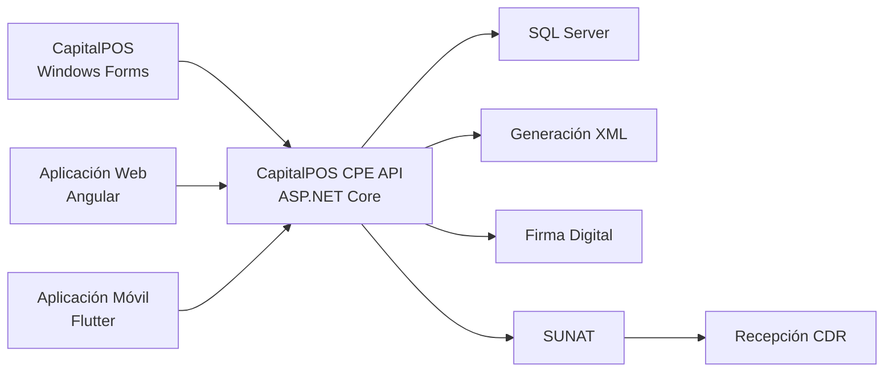
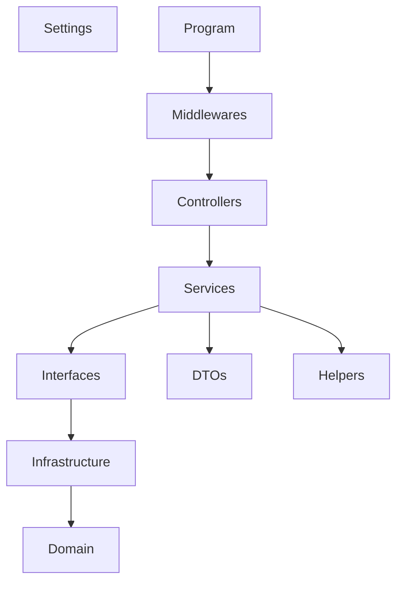
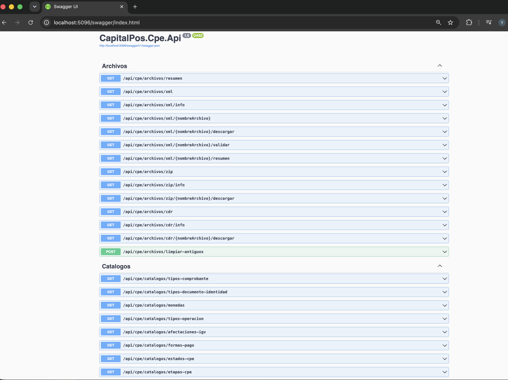
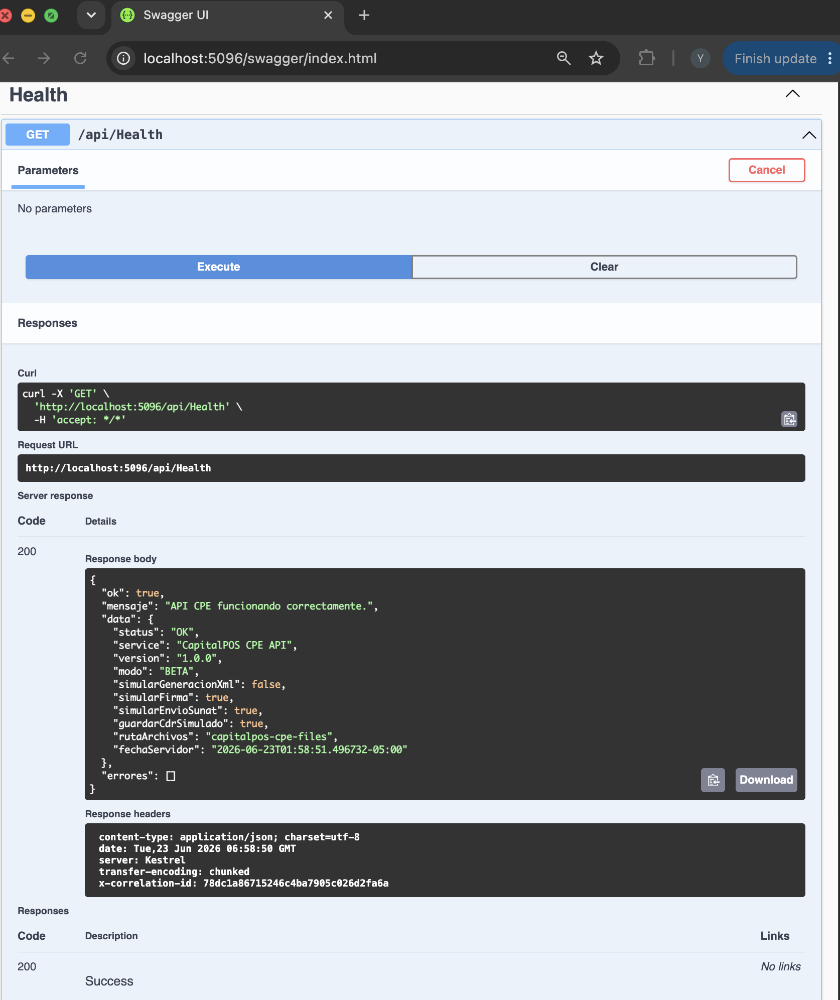
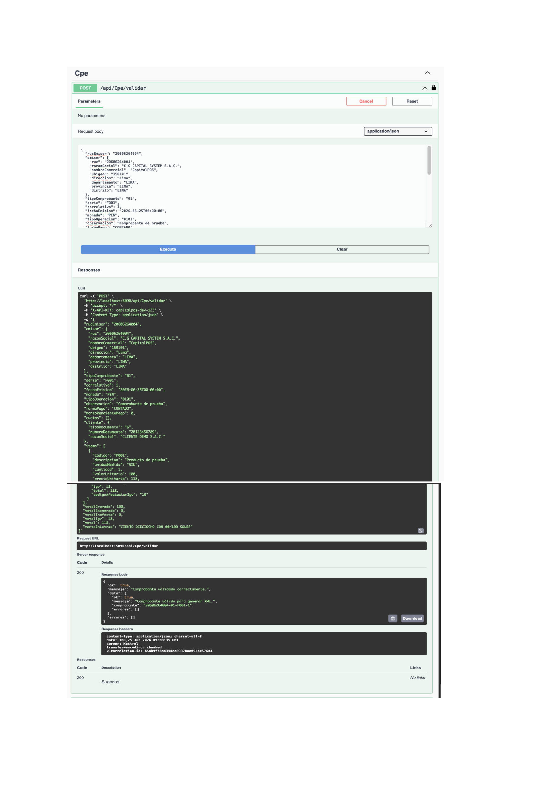
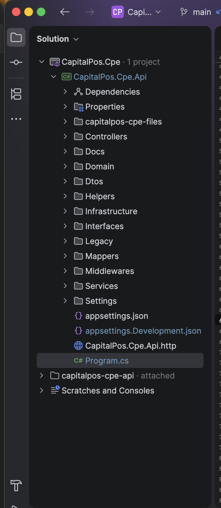

# 🚀 CapitalPOS CPE API

> Backend desarrollado en **ASP.NET Core** para la emisión, validación y gestión de comprobantes electrónicos SUNAT.


---

# 📖 Descripción

CapitalPOS CPE API forma parte de la evolución tecnológica de **CapitalPOS**, un sistema comercial desarrollado durante más de **7 años**, utilizado para la gestión de ventas, inventarios y facturación electrónica.

El objetivo del proyecto es desacoplar completamente la lógica de Facturación Electrónica del sistema Windows Forms para convertirla en una API REST reutilizable por aplicaciones Desktop, Web y Mobile.

Actualmente este backend forma parte de la migración tecnológica del producto hacia una arquitectura moderna basada en **ASP.NET Core**.

---

# 💡 ¿Por qué este proyecto?

CapitalPOS nació como una aplicación Windows Forms.

Conforme fue creciendo el producto surgió la necesidad de desacoplar toda la lógica de Facturación Electrónica para que pudiera ser utilizada por distintos clientes:

- Windows Forms
- Aplicaciones Web
- Aplicaciones móviles
- Integraciones con terceros

Por ello se desarrolló esta API REST utilizando ASP.NET Core.

---

# 🛠 Tecnologías

- ASP.NET Core 7
- C#
- SQL Server
- REST API
- Swagger / OpenAPI
- Dependency Injection
- Middleware
- Arquitectura por Capas
- Git
- GitHub

---

# 🏗 Arquitectura General



---

# 🏛 Arquitectura Interna



---

# 📸 Capturas

## Swagger

Visualización de todos los endpoints disponibles.



---

## Health Check

Estado de la API.



---

## Validación de Comprobantes

Validación de datos antes de generar el XML.



---

## Generación de XML

Proceso de generación del comprobante electrónico.


---

## Arquitectura del Proyecto

Estructura del proyecto en Rider.



---

# 📂 Organización del Proyecto

```
CapitalPos.Cpe.Api
│
├── Controllers
├── Docs
├── Domain
├── DTOs
├── Helpers
├── Infrastructure
│   ├── Firma
│   ├── Storage
│   ├── Sunat
│   └── Xml
├── Interfaces
├── Legacy
├── Mappers
├── Middlewares
├── Services
├── Settings
└── Program.cs
```

---

# ✅ Funcionalidades

## Gestión de Comprobantes

- Validación de comprobantes electrónicos
- Generación XML UBL
- Firma Digital (Modo Simulación)
- Envío SUNAT (Modo Simulación)
- Gestión de archivos XML
- Historial de operaciones

---

## Seguridad

- API Key Authentication
- Middleware personalizado
- Correlation ID
- Global Exception Middleware

---

## Diagnóstico

- Health Check
- Diagnóstico
- Historial
- Configuración

---

# 🌐 Endpoints

| Método | Endpoint | Descripción |
|---------|----------|-------------|
| GET | `/api/health` | Estado de la API |
| POST | `/api/cpe/validar` | Validación |
| POST | `/api/cpe/generar-xml` | Generación XML |
| POST | `/api/cpe/demo/emitir` | Emisión Demo |
| GET | `/api/cpe/config` | Configuración |
| GET | `/api/cpe/diagnostico` | Diagnóstico |

---

# 🚧 Estado del Proyecto

Proyecto en desarrollo activo.

Actualmente forma parte de la migración tecnológica de **CapitalPOS**, evolucionando desde Windows Forms hacia una arquitectura basada en APIs REST utilizando ASP.NET Core.

---

# 🗺 Roadmap

- ✅ Arquitectura Base
- ✅ Controllers
- ✅ Services
- ✅ Dependency Injection
- ✅ Health Check
- ✅ Swagger
- ✅ API Key Authentication
- ✅ Validación
- ✅ Generación XML
- ✅ Historial
- 🔄 Firma Digital Producción
- 🔄 Integración SUNAT Producción
- 🔄 Recepción CDR
- 🔄 OAuth / JWT
- 🔄 Frontend Angular
- 🔄 Aplicación Flutter

---

# 👨‍💻 Autor

## Yhort Anthony Cruz Arbañil

Full Stack Developer

Especialista en:

- ASP.NET Core
- C#
- SQL Server
- Windows Forms
- Angular
- REST APIs
- Facturación Electrónica SUNAT

---

## ⭐ Evolución del Proyecto

```text
CapitalPOS Windows Forms
            │
            ▼
 Migración de Facturación Electrónica
            │
            ▼
     CapitalPOS CPE API
            │
            ▼
      Angular + Flutter
```
